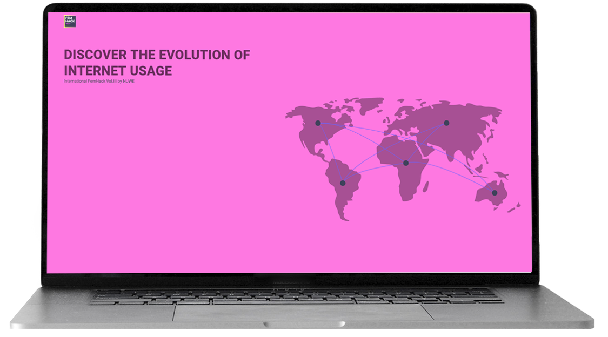
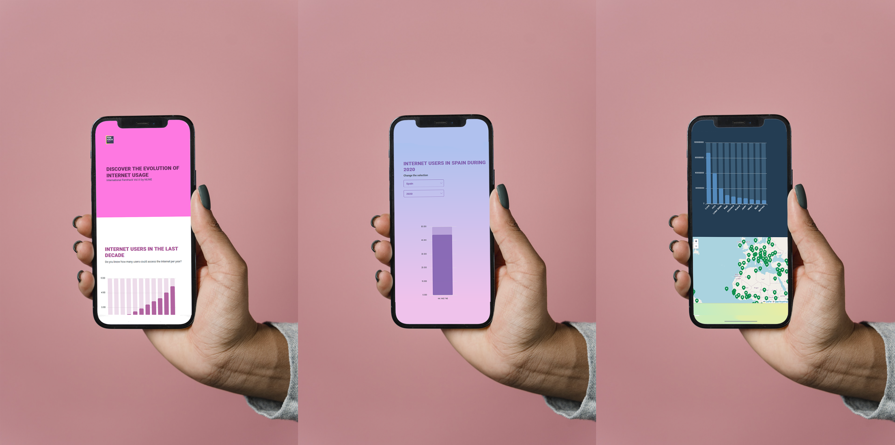
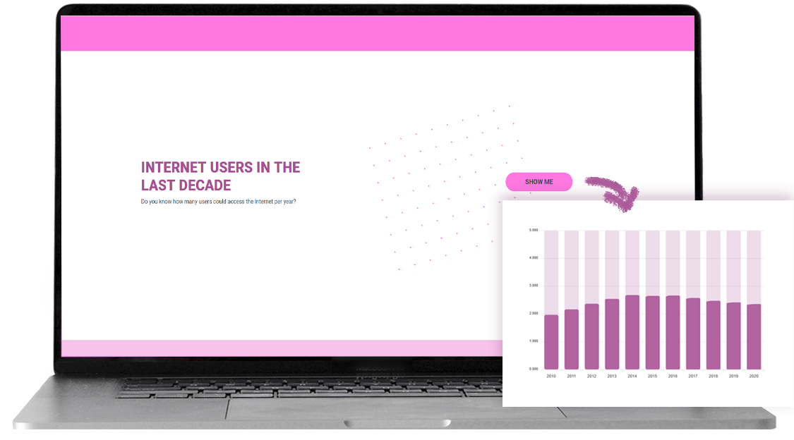
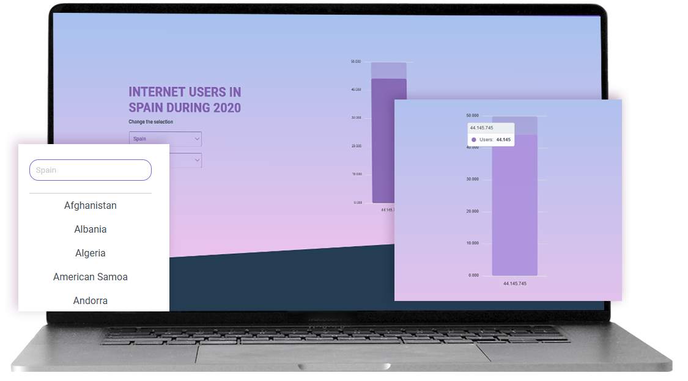
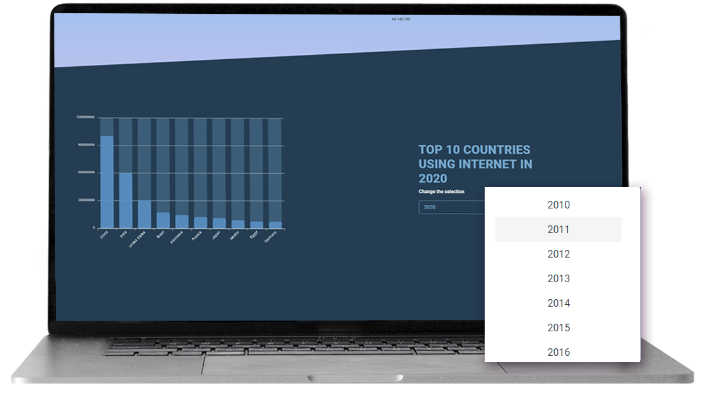
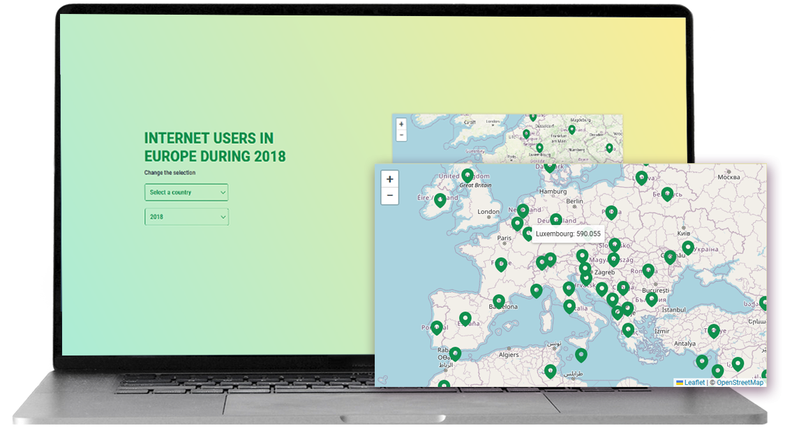

# 👩🏻‍💻 International FemHack Vol.II 📊 - Frontend Challenge  
The Frontend FemHack Challenge organized by nuwe in this II edition consisted in developing a landing page to show data visualization in an attractive way. 
To carry out this challenge I used the [backend](https://github.com/nuwe-reports/femhack-II-frontend-challenge) that they have provided, and the tasks consisted of making requests to the backend endopints and display the data in graphs.

  
  
## 🤩 Objectives achieved:

➜ Manage the backend data to display them correctly  
➜ Using a chart library  
➜ Using a map library  
➜ Displaying the layout result in a landing page
➜ Develop a responsive layout  
➜ Using a map library  
➜ Use animations  
  
## 🥺 Goals I didn't achieve:

➜ I would have liked to have had more time to dedicate to the design and create something really visually stunning
➜ I would have liked to make more interactive animations 

---



---

## 📂 What do you need to have installed on your computer?

➜ [Docker](https://www.docker.com/)  
➜ Node [LTS Version](https://nodejs.org/en/)  
➜ Angular: npm install -g @angular/cli  
  
## ⚙️💾 Download & Settings to test the frontend   

➜ Create a folder for the project and run  
➜ Clone project :  git clone "https://github.com/abigailojeda/femHack23.git" .  
➜ 💁🏻 Tip: With the "." at the end you specify that you want the project to be cloned in that folder, and not create a new folder inside it to save the cloned project   

Once you have the cloned project you will only have to execute in your console the commands  
➜ npm i  
➜ npm start

---

### 📚 This project use:

I have developed the frontend with [Angular](https://angular.io/) v14

➜ Lazy loading modules  
➜ RxJS  
➜ Pipes

➜ [Apexcharts](https://apexcharts.com/)  
➜ [Leaflet](https://leafletjs.com/)  
➜ [Animate.css](https://animate.style/)  

---
### 🎨 Design resources:

➜ [Roboto font - Google fonts](https://fonts.google.com/specimen/Roboto?query=roboto)  
➜ [Opensource illustrations](https://undraw.co/search)  
➜ [CSS background patterns](https://www.magicpattern.design/tools/css-backgrounds)  
➜ [Nice gradients for css backgrounds](https://webgradients.com/)  
➜ [svg icons](https://heroicons.com/)  
➜ [emojis for README](https://emojidb.org/unicorn-emojis)  
➜ [mockup image](https://www.pexels.com/es-es/foto/mano-telefono-inteligente-maqueta-telefono-movil-6612388/)  

---

# 📝 TASKS  


I created a component for each task and handled the data with a service to make the requests with HttpClient  

```javascript
export class ChartsService {
  private apiUrl:string= environment.url;

  constructor(private http: HttpClient) {}

  //users x year ( all the world )
  getUsersByYear(year: number): Observable<any> {
    return this.http.get(`${this.apiUrl}/internet-users/${year}`);
  }
  //users x year ( specifying countries )
  getUsersAndCountries(year: number): Observable<any> {
    return this.http.get(`${this.apiUrl}/year/${year}`);
  }

  getUsersForMultipleYears(years: number[]): Observable<any[]> {
    const requests: Observable<any>[] = years.map((year) => this.getUsersByYear(year));
    return forkJoin(requests);
  }

  //countries
  getCountries(): Observable<any> {
    return this.http.get(`${this.apiUrl}/countries`);
  }
  
  //users x year x country
  getUsersByCountryAndYear(country: string, year: number): Observable<any> {
    return this.http.get(`${this.apiUrl}/country/${country}/year/${year}`);
  }
}
```

### ➜ CHART 1 : Internet Users x Year  

For this first task I simply make a request to which I subscribe, and when the response arrives I configure the graph with the received data.  

```javascript
this.chartsService
      .getUsersForMultipleYears(this.years)
      .subscribe((res: any[]) => {
        this.userData = res.map((response, index) => ({
          year: this.years[index],
          users: response.Data.Total,
        }));

        this.plotOptions = {
          bar: {
            borderRadius: 5,
            colors: {
              ranges: [{ from: 0, to: 10000000000000000, color: '#a75094' }],
              backgroundBarColors: ['#a75094'],
              backgroundBarOpacity: 0.2,
              backgroundBarRadius: 5,
            },
          },
        };

        this.chart = {
          type: 'bar',
          width: '80%',
          height: '500px',
          animations: {
            enabled: true,
            easing: 'linear',
            speed: 2000,

            dynamicAnimation: {
              enabled: true,
              speed: 2000,
            },
          },
        };
        this.chartSeries[0].data = this.userData.map((data) =>
          data.users.toLocaleString()
        );
        this.userData.map((data) =>
          this.chartXAxis.categories.push(data.year.toString())
        );
});
``` 
I have decided that this graph is shown when clicking on a button to invite the user to interact and to see the animation of the graph, which is only executed when it is rendered

  


### ➜ CHART 2 : Internet Users x Year x Country  

In this case I start the component with the data obtained with a default country and year of the service and the user can change the country or year using a dropdown and the data is updated with his choice by redoing the request.  
```javascript
  ngOnInit(): void {
  //...
   this.setChart()
  });

  public selectCountry(country: string) {
    this.country = country;
    this.setChart();
  }

  public selectYear(year: string) {
    this.year = year;
    this.setChart();
  }

  setChart(): void {
  //...
  }
```



### ➜ CHART 3 : Top 10 Countries using internet x Year  

For this graph I obtain the data for a given year and sort the countries of the response by number of users using the sort() function and finally I am left with the ten with the most users  

```javascript
  this.chartsService.getUsersAndCountries(parseInt(this.year)).subscribe({
        next: (res: any) => {
          const countriesData = res.Data;

          const topCountries = Object.keys(countriesData)
            .map((country: string) => ({
              country,
              users: countriesData[country].internet_users_number,
            }))
            .sort((a, b) => b.users - a.users)
            .slice(0, 10);
          //...
      });
```  

As in the previous graph, the user can change the year to make a new request



### ➜ TAKS 2 : Animations

One of the objectives of this challenge was to animate the graphics to make them more attractive to the user. The apexcharts library allows to configure the animation that the graphic will show when rendered:

```javascript
this.chart = {
  type: "bar",

    ...

  animations: {
    enabled: true,
    easing: "linear",
    speed: 2000,

    dynamicAnimation: {
      enabled: true,
      speed: 2000,
    },
  },
};
```  
  
On the other hand, Animate.css is very easy to use and has very good results for animating web page elements. In this case I have used it to animate the title of the header.  

### ➜ TAKS 3 : World map data visualization  
This task was an added difficulty by not providing the coordinates of the countries, since I did not find quality documentation to know how leaflet provides coordinates, apart from using the geocoder function, for which I would have to make a request for each country and it is not optimal.
For this reason I have used a list of longitudes and latitudes of countries that I had from a personal project and I have mocked it into a service  

```javascript
 this.countriesData = {
      "Afghanistan": [33.9391, 67.7100],
      "Albania": [41.1533, 20.1683],
      "Algeria": [28.0339, 1.6596],
      "American Samoa": [-14.2710, -170.1322],
      //...
}
```

  

🐛 A small bug: when selecting country or year the data is updated. However when selecting the year I wanted to make an animation to show that there has been a change in the data but I didn't have time to do it. It may look like a bug but actually what happens is that the transition is not noticeable
```javascript
  public setUsers() {
    this.chartsService
      .getUsersAndCountries(parseInt(this.year))
      .subscribe((response) => {
        this.countries = response.Data;
        this.addMarkers();
      });
  }

  public addMarkers(): void {
  //...
  Object.entries(countriesData).forEach(
      ([countryName, countryCoordinates]: [string, number[]]) => {
        const countryData = this.countries[countryName];

        if (countryData) {
          const internetUsersNumber = countryData.internet_users_number;
          const [lat, lon] = countryCoordinates;

          const marker = L.marker([lat, lon], { icon: markerIcon }).addTo(
            this.map!
          );
          marker.bindTooltip(
            `${countryName}: ${internetUsersNumber.toLocaleString()}`
          );
        }
      }
    );
```
In the object of countries with coordinates I access the number of users corresponding to each country in the object that I have previously saved from the backend request, and with that data I create a marker on the map for each country.  


---

🙋🏻‍♀️[Abigail Ojeda Alonso](https://es.linkedin.com/in/abigail-ojeda)
